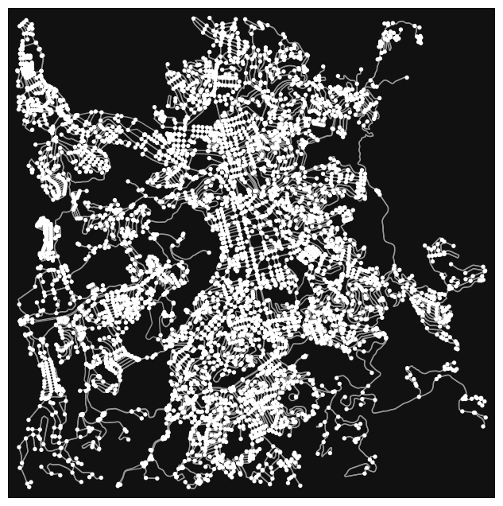
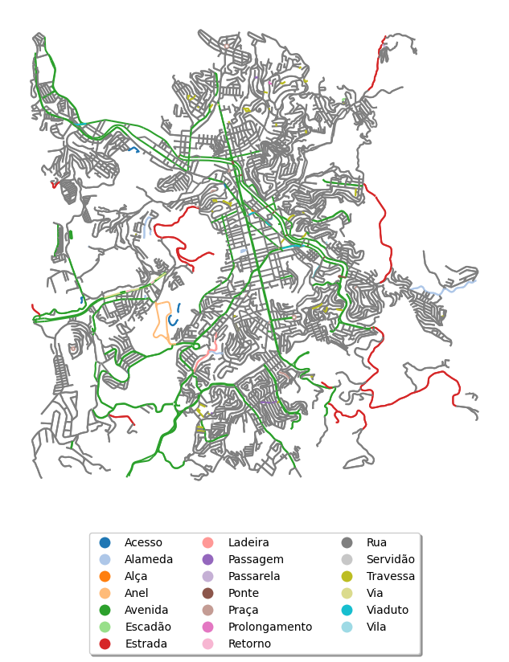

# Mapeamento dos tipos de logradouro com *osmnx*

Anteriormente, utilizamos o pacote *oxmnx* - desenvolvido e mantido por Geoff Boeing, professor de Planejamento Urbano e Análise Espacial da USC - University of Southern California - para análise de redes viárias urbanas.

Agora, inspirados no [*post*](https://jackmckew.dev/street-suffix-analysis-colouring-with-python) intitulado *Street Suffix Analysis & Colouring with Python*, atualizamos o código escrito pelo cientista de dados Jack McKew para visualização das vias públicas de Juiz de Fora/MG, por tipo de logradouro.


### Importamos as bibliotecas


```python
import osmnx as ox
import matplotlib.pyplot as plt
import matplotlib.cm as cm
import numpy as np
import pandas as pd
import seaborn as sns
```

### Configuramos o pacote *osmnx*


```python
ox.settings.log_console = True
ox.settings.use_cache = True
ox.settings.cache_folder = "./cache"  
```

### Configuramos o padrão de visualização


```python
%matplotlib inline
plt.rcParams['figure.figsize'] = [10, 8]
plt.rcParams['figure.dpi'] = 100
```

### Verificamos a versão 


```python
print(f"OSMnx versão: {ox.__version__}")
```

    OSMnx versão: 2.0.3


### Definimos o ponto de referência


```python
address = "Avenida Rio Branco, 2340 - Centro, Juiz de Fora, Minas Gerais, Brasil"
```

### Extraímos o gráfico da rede viária

Extraímos o gráfico da rede destinada ao tráfego de veículos, a uma distância de 5 km a partir do ponto de referência.


```python
graph = ox.graph_from_address(address,network_type='drive',dist=5000)
```

### Plotamos o gráfico


```python
fig, ax = ox.plot_graph(graph)

plt.tight_layout()
```


    

    


    <Figure size 1000x800 with 0 Axes>


### *GeoDataFrame*

Convertemos o gráfico em um *GeoDataFrame*, uma estrutura de dados especializada para análise espacial que, além das funcionalidades de um *DataFrame* do pandas, inclui uma coluna com informações geográficas, como *pontos*, *linhas* e *polígonos*.


```python
nodes, streets = ox.graph_to_gdfs(graph)

display(streets)
```


<div>

<table border="1" class="dataframe">
  <thead>
    <tr style="text-align: right;">
      <th></th>
      <th></th>
      <th></th>
      <th>osmid</th>
      <th>highway</th>
      <th>lanes</th>
      <th>maxspeed</th>
      <th>name</th>
      <th>oneway</th>
      <th>ref</th>
      <th>reversed</th>
      <th>length</th>
      <th>geometry</th>
      <th>junction</th>
      <th>access</th>
      <th>bridge</th>
      <th>tunnel</th>
      <th>width</th>
    </tr>
    <tr>
      <th>u</th>
      <th>v</th>
      <th>key</th>
      <th></th>
      <th></th>
      <th></th>
      <th></th>
      <th></th>
      <th></th>
      <th></th>
      <th></th>
      <th></th>
      <th></th>
      <th></th>
      <th></th>
      <th></th>
      <th></th>
      <th></th>
    </tr>
  </thead>
  <tbody>
    <tr>
      <th rowspan="2" valign="top">254430253</th>
      <th>3144183036</th>
      <th>0</th>
      <td>965039147</td>
      <td>trunk</td>
      <td>2</td>
      <td>60</td>
      <td>Avenida Presidente Juscelino Kubitschek</td>
      <td>True</td>
      <td>BR-267</td>
      <td>False</td>
      <td>44.800575</td>
      <td>LINESTRING (-43.39624 -21.72894, -43.39624 -21...</td>
      <td>NaN</td>
      <td>NaN</td>
      <td>NaN</td>
      <td>NaN</td>
      <td>NaN</td>
    </tr>
    <tr>
      <th>3144183105</th>
      <th>0</th>
      <td>965751638</td>
      <td>residential</td>
      <td>NaN</td>
      <td>NaN</td>
      <td>Rua Vila Vidal</td>
      <td>True</td>
      <td>NaN</td>
      <td>False</td>
      <td>14.418744</td>
      <td>LINESTRING (-43.39624 -21.72894, -43.3963 -21....</td>
      <td>NaN</td>
      <td>NaN</td>
      <td>NaN</td>
      <td>NaN</td>
      <td>NaN</td>
    </tr>
    <tr>
      <th>254451503</th>
      <th>254451510</th>
      <th>0</th>
      <td>966571341</td>
      <td>secondary</td>
      <td>2</td>
      <td>NaN</td>
      <td>Avenida Garcia Rodrigues Paes</td>
      <td>True</td>
      <td>NaN</td>
      <td>False</td>
      <td>66.641533</td>
      <td>LINESTRING (-43.39216 -21.73075, -43.39201 -21...</td>
      <td>NaN</td>
      <td>NaN</td>
      <td>NaN</td>
      <td>NaN</td>
      <td>NaN</td>
    </tr>
    <tr>
      <th>254451510</th>
      <th>3138712506</th>
      <th>0</th>
      <td>1247489584</td>
      <td>secondary</td>
      <td>2</td>
      <td>NaN</td>
      <td>Avenida Garcia Rodrigues Paes</td>
      <td>True</td>
      <td>NaN</td>
      <td>False</td>
      <td>55.196834</td>
      <td>LINESTRING (-43.39178 -21.73124, -43.3916 -21....</td>
      <td>NaN</td>
      <td>NaN</td>
      <td>NaN</td>
      <td>NaN</td>
      <td>NaN</td>
    </tr>
    <tr>
      <th>254451523</th>
      <th>3146011152</th>
      <th>0</th>
      <td>309267646</td>
      <td>residential</td>
      <td>NaN</td>
      <td>NaN</td>
      <td>Rua Nunes Lima</td>
      <td>False</td>
      <td>NaN</td>
      <td>False</td>
      <td>68.359396</td>
      <td>LINESTRING (-43.39048 -21.73192, -43.39089 -21...</td>
      <td>NaN</td>
      <td>NaN</td>
      <td>NaN</td>
      <td>NaN</td>
      <td>NaN</td>
    </tr>
    <tr>
      <th>...</th>
      <th>...</th>
      <th>...</th>
      <td>...</td>
      <td>...</td>
      <td>...</td>
      <td>...</td>
      <td>...</td>
      <td>...</td>
      <td>...</td>
      <td>...</td>
      <td>...</td>
      <td>...</td>
      <td>...</td>
      <td>...</td>
      <td>...</td>
      <td>...</td>
      <td>...</td>
    </tr>
    <tr>
      <th>13318480165</th>
      <th>337141474</th>
      <th>0</th>
      <td>[964406963, 274562132]</td>
      <td>secondary</td>
      <td>[1, 2]</td>
      <td>60</td>
      <td>Anel Viário</td>
      <td>True</td>
      <td>NaN</td>
      <td>False</td>
      <td>284.949761</td>
      <td>LINESTRING (-43.36691 -21.78148, -43.36703 -21...</td>
      <td>NaN</td>
      <td>NaN</td>
      <td>NaN</td>
      <td>NaN</td>
      <td>NaN</td>
    </tr>
    <tr>
      <th rowspan="3" valign="top">13318480199</th>
      <th>1337633559</th>
      <th>0</th>
      <td>893642589</td>
      <td>secondary</td>
      <td>2</td>
      <td>NaN</td>
      <td>Rua Engenheiro José Carlos Moraes Sarmento</td>
      <td>False</td>
      <td>NaN</td>
      <td>True</td>
      <td>10.963133</td>
      <td>LINESTRING (-43.35574 -21.74929, -43.35563 -21...</td>
      <td>NaN</td>
      <td>NaN</td>
      <td>NaN</td>
      <td>NaN</td>
      <td>NaN</td>
    </tr>
    <tr>
      <th>1337623335</th>
      <th>0</th>
      <td>118990774</td>
      <td>residential</td>
      <td>NaN</td>
      <td>NaN</td>
      <td>Acesso Igreja da Glória</td>
      <td>True</td>
      <td>NaN</td>
      <td>False</td>
      <td>73.421520</td>
      <td>LINESTRING (-43.35574 -21.74929, -43.35569 -21...</td>
      <td>NaN</td>
      <td>NaN</td>
      <td>NaN</td>
      <td>NaN</td>
      <td>NaN</td>
    </tr>
    <tr>
      <th>1337633539</th>
      <th>0</th>
      <td>893642589</td>
      <td>secondary</td>
      <td>2</td>
      <td>NaN</td>
      <td>Rua Engenheiro José Carlos Moraes Sarmento</td>
      <td>False</td>
      <td>NaN</td>
      <td>False</td>
      <td>142.617691</td>
      <td>LINESTRING (-43.35574 -21.74929, -43.35588 -21...</td>
      <td>NaN</td>
      <td>NaN</td>
      <td>NaN</td>
      <td>NaN</td>
      <td>NaN</td>
    </tr>
    <tr>
      <th>13337318474</th>
      <th>3094007547</th>
      <th>0</th>
      <td>1454297542</td>
      <td>tertiary</td>
      <td>2</td>
      <td>NaN</td>
      <td>Rua Anhanguera</td>
      <td>False</td>
      <td>NaN</td>
      <td>False</td>
      <td>64.090868</td>
      <td>LINESTRING (-43.33489 -21.77749, -43.33513 -21...</td>
      <td>NaN</td>
      <td>NaN</td>
      <td>NaN</td>
      <td>NaN</td>
      <td>NaN</td>
    </tr>
  </tbody>
</table>
<p>12134 rows × 15 columns</p>
</div>


### Extraímos os tipos de logradouro

Criamos a coluna *street_type* para armazenar o tipo de logradouro de cada endereço, definido pela primeiro termo de cada linha da coluna *name*.


```python
def get_road_type(street_name):
    if isinstance(street_name,list):
        street_name = street_name[0]
    return street_name.split()[0]  

streets = streets[streets['name'].notna()]
streets['street_type'] = streets['name'].apply(get_road_type)
display(streets)
```


<div>

<table border="1" class="dataframe">
  <thead>
    <tr style="text-align: right;">
      <th></th>
      <th></th>
      <th></th>
      <th>osmid</th>
      <th>highway</th>
      <th>lanes</th>
      <th>maxspeed</th>
      <th>name</th>
      <th>oneway</th>
      <th>ref</th>
      <th>reversed</th>
      <th>length</th>
      <th>geometry</th>
      <th>junction</th>
      <th>access</th>
      <th>bridge</th>
      <th>tunnel</th>
      <th>width</th>
      <th>street_type</th>
    </tr>
    <tr>
      <th>u</th>
      <th>v</th>
      <th>key</th>
      <th></th>
      <th></th>
      <th></th>
      <th></th>
      <th></th>
      <th></th>
      <th></th>
      <th></th>
      <th></th>
      <th></th>
      <th></th>
      <th></th>
      <th></th>
      <th></th>
      <th></th>
      <th></th>
    </tr>
  </thead>
  <tbody>
    <tr>
      <th rowspan="2" valign="top">254430253</th>
      <th>3144183036</th>
      <th>0</th>
      <td>965039147</td>
      <td>trunk</td>
      <td>2</td>
      <td>60</td>
      <td>Avenida Presidente Juscelino Kubitschek</td>
      <td>True</td>
      <td>BR-267</td>
      <td>False</td>
      <td>44.800575</td>
      <td>LINESTRING (-43.39624 -21.72894, -43.39624 -21...</td>
      <td>NaN</td>
      <td>NaN</td>
      <td>NaN</td>
      <td>NaN</td>
      <td>NaN</td>
      <td>Avenida</td>
    </tr>
    <tr>
      <th>3144183105</th>
      <th>0</th>
      <td>965751638</td>
      <td>residential</td>
      <td>NaN</td>
      <td>NaN</td>
      <td>Rua Vila Vidal</td>
      <td>True</td>
      <td>NaN</td>
      <td>False</td>
      <td>14.418744</td>
      <td>LINESTRING (-43.39624 -21.72894, -43.3963 -21....</td>
      <td>NaN</td>
      <td>NaN</td>
      <td>NaN</td>
      <td>NaN</td>
      <td>NaN</td>
      <td>Rua</td>
    </tr>
    <tr>
      <th>254451503</th>
      <th>254451510</th>
      <th>0</th>
      <td>966571341</td>
      <td>secondary</td>
      <td>2</td>
      <td>NaN</td>
      <td>Avenida Garcia Rodrigues Paes</td>
      <td>True</td>
      <td>NaN</td>
      <td>False</td>
      <td>66.641533</td>
      <td>LINESTRING (-43.39216 -21.73075, -43.39201 -21...</td>
      <td>NaN</td>
      <td>NaN</td>
      <td>NaN</td>
      <td>NaN</td>
      <td>NaN</td>
      <td>Avenida</td>
    </tr>
    <tr>
      <th>254451510</th>
      <th>3138712506</th>
      <th>0</th>
      <td>1247489584</td>
      <td>secondary</td>
      <td>2</td>
      <td>NaN</td>
      <td>Avenida Garcia Rodrigues Paes</td>
      <td>True</td>
      <td>NaN</td>
      <td>False</td>
      <td>55.196834</td>
      <td>LINESTRING (-43.39178 -21.73124, -43.3916 -21....</td>
      <td>NaN</td>
      <td>NaN</td>
      <td>NaN</td>
      <td>NaN</td>
      <td>NaN</td>
      <td>Avenida</td>
    </tr>
    <tr>
      <th>254451523</th>
      <th>3146011152</th>
      <th>0</th>
      <td>309267646</td>
      <td>residential</td>
      <td>NaN</td>
      <td>NaN</td>
      <td>Rua Nunes Lima</td>
      <td>False</td>
      <td>NaN</td>
      <td>False</td>
      <td>68.359396</td>
      <td>LINESTRING (-43.39048 -21.73192, -43.39089 -21...</td>
      <td>NaN</td>
      <td>NaN</td>
      <td>NaN</td>
      <td>NaN</td>
      <td>NaN</td>
      <td>Rua</td>
    </tr>
    <tr>
      <th>...</th>
      <th>...</th>
      <th>...</th>
      <td>...</td>
      <td>...</td>
      <td>...</td>
      <td>...</td>
      <td>...</td>
      <td>...</td>
      <td>...</td>
      <td>...</td>
      <td>...</td>
      <td>...</td>
      <td>...</td>
      <td>...</td>
      <td>...</td>
      <td>...</td>
      <td>...</td>
      <td>...</td>
    </tr>
    <tr>
      <th>13318480165</th>
      <th>337141474</th>
      <th>0</th>
      <td>[964406963, 274562132]</td>
      <td>secondary</td>
      <td>[1, 2]</td>
      <td>60</td>
      <td>Anel Viário</td>
      <td>True</td>
      <td>NaN</td>
      <td>False</td>
      <td>284.949761</td>
      <td>LINESTRING (-43.36691 -21.78148, -43.36703 -21...</td>
      <td>NaN</td>
      <td>NaN</td>
      <td>NaN</td>
      <td>NaN</td>
      <td>NaN</td>
      <td>Anel</td>
    </tr>
    <tr>
      <th rowspan="3" valign="top">13318480199</th>
      <th>1337633559</th>
      <th>0</th>
      <td>893642589</td>
      <td>secondary</td>
      <td>2</td>
      <td>NaN</td>
      <td>Rua Engenheiro José Carlos Moraes Sarmento</td>
      <td>False</td>
      <td>NaN</td>
      <td>True</td>
      <td>10.963133</td>
      <td>LINESTRING (-43.35574 -21.74929, -43.35563 -21...</td>
      <td>NaN</td>
      <td>NaN</td>
      <td>NaN</td>
      <td>NaN</td>
      <td>NaN</td>
      <td>Rua</td>
    </tr>
    <tr>
      <th>1337623335</th>
      <th>0</th>
      <td>118990774</td>
      <td>residential</td>
      <td>NaN</td>
      <td>NaN</td>
      <td>Acesso Igreja da Glória</td>
      <td>True</td>
      <td>NaN</td>
      <td>False</td>
      <td>73.421520</td>
      <td>LINESTRING (-43.35574 -21.74929, -43.35569 -21...</td>
      <td>NaN</td>
      <td>NaN</td>
      <td>NaN</td>
      <td>NaN</td>
      <td>NaN</td>
      <td>Acesso</td>
    </tr>
    <tr>
      <th>1337633539</th>
      <th>0</th>
      <td>893642589</td>
      <td>secondary</td>
      <td>2</td>
      <td>NaN</td>
      <td>Rua Engenheiro José Carlos Moraes Sarmento</td>
      <td>False</td>
      <td>NaN</td>
      <td>False</td>
      <td>142.617691</td>
      <td>LINESTRING (-43.35574 -21.74929, -43.35588 -21...</td>
      <td>NaN</td>
      <td>NaN</td>
      <td>NaN</td>
      <td>NaN</td>
      <td>NaN</td>
      <td>Rua</td>
    </tr>
    <tr>
      <th>13337318474</th>
      <th>3094007547</th>
      <th>0</th>
      <td>1454297542</td>
      <td>tertiary</td>
      <td>2</td>
      <td>NaN</td>
      <td>Rua Anhanguera</td>
      <td>False</td>
      <td>NaN</td>
      <td>False</td>
      <td>64.090868</td>
      <td>LINESTRING (-43.33489 -21.77749, -43.33513 -21...</td>
      <td>NaN</td>
      <td>NaN</td>
      <td>NaN</td>
      <td>NaN</td>
      <td>NaN</td>
      <td>Rua</td>
    </tr>
  </tbody>
</table>
<p>10744 rows × 16 columns</p>
</div>


### Identificamos os tipos de logradouro


```python
streets['street_type'].unique()
```


    array(['Avenida', 'Rua', 'Anel', 'Ladeira', 'Alameda', 'Estrada', 'Praça',
           'Via', 'Viaduto', 'Passarela', 'Travessa', 'Alça', 'Ponte',
           'Acesso', 'Lane', 'Eugênio', 'Lourdes', 'Passagem', 'Retorno',
           'Barão', 'Maria', 'Major', 'Pintor', 'Vila', 'ADÉLIA', 'SÔNIA',
           'Prolongamento', 'Escadão', 'Antônio', 'AABB', 'Servidão',
           'Ernestina', 'Ludgéro', 'Padre'], dtype=object)


### Filtramos os tipos de logradouro

Implementamos um filtro para remover os tipos indesejados retornados pela função *get_road_type()*.


```python

def get_valid_road_type(street_name):
    if isinstance(street_name, list):
        street_name = street_name[0]
    
    street_name = str(street_name)
    
    # Limpa caracteres
    if street_name.startswith("['"):
        street_name = street_name[2:]
    street_name = street_name.rstrip("']").strip()
    
    words = street_name.split()
    if not words:
        return None
    
    street_type = words[0]
    
    # Lista dos tipos a serem mantidos
    valid_types = {'Avenida', 'Rua', 'Anel', 'Ladeira', 'Alameda', 'Estrada', 'Praça',
       'Via', 'Viaduto', 'Passarela', 'Travessa', 'Alça', 'Ponte',
       'Acesso', 'Passagem', 'Retorno', 'Vila', 'Prolongamento', 'Escadão', 'Servidão'}
    
    return street_type if street_type in valid_types else None

streets['street_type'] = streets['name'].apply(get_valid_road_type)
streets = streets[streets['street_type'].notna()]  # Remove os que não têm tipo válido
```

### Plotamos os tipos de logradouro


```python
colormap = plt.colormaps.get_cmap('tab20')

ax = streets.plot(column='street_type',
                  legend=True,
                  cmap=colormap,
                  legend_kwds={
                      'bbox_to_anchor':(0.5,-0.05),
                      'shadow':True,
                      'ncol':3,
                      'loc':'upper center'})

ax.axis('off')
fig = ax.get_figure()
fig.savefig('street_type_map.svg',bbox_inches='tight')
```


    



**Considerações finais**

Os tipos mais comuns são: 
* **Rua**: via urbana comum para veículos e pedestres;
* **Avenida**: via urbana mais larga, importante para a gestão do fluxo de veículos;
* * **Travessa**: rua estreita, atalho entre vias maiores;
* **Praça**: espaço público aberto, geralmente com áreas verdes e bancos.

As avenidas são os principais eixos de circulação interna, enquanto as estradas ligam a zona urbana à rural e a municípios vizinhos (algumas funcionam como vias de expansão urbana). Servidão, passagem e escadão indicam vias de pedestres ou locais, muitas vezes em áreas de topografia acidentada. Ladeiras indicam vias inclinadas, sobretudo em bairros com relevo montanhoso.
    


**Referências**

Boeing, G. (2025). *Modeling and Analyzing Urban Networks and Amenities with OSMnx*. Geographical Analysis 57 (4), 567-577. doi:10.1111/gean.70009

Ferreira, G. (2025). *Análise de redes viárias urbanas*. GitHub. Disponível em: https://github.com/guiajf/osmnx.

McKew, J. (2020). *Street Suffix Analysis & Colouring with Python*. Jack McKew's Blog. Posted on Fri 24 July 2020 in Data Science. Disponível em: https://jackmckew.dev/street-suffix-analysis-colouring-with-python. Último acesso em: 06/12/2025.


```python

```
